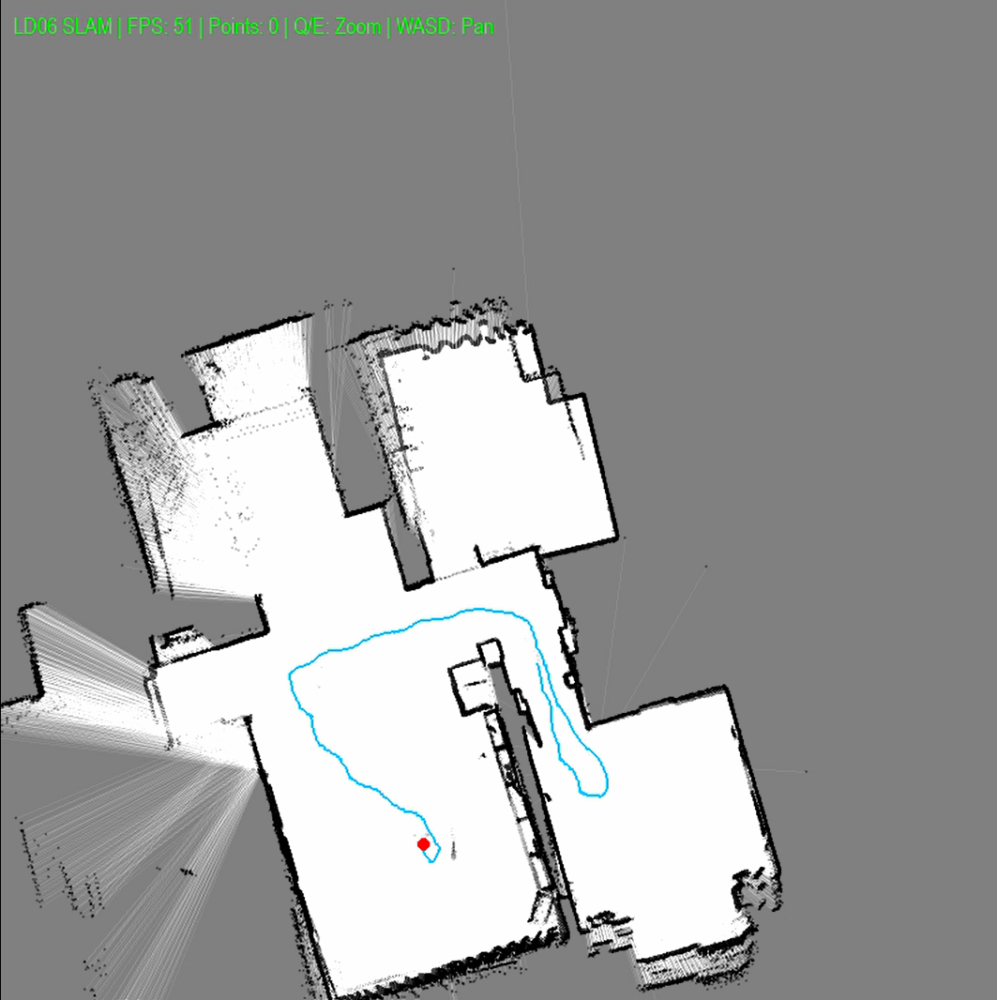

# LD-06-SLAM

A Simultaneous Localization and Mapping (SLAM) implementation using an LD-06 LiDAR sensor. This project creates real-time 2D maps of environments using LiDAR data and pose estimation algorithms.

## Features

- Real-time SLAM processing with LD-06 LiDAR
- Multi-threaded data parsing for efficient performance
- Pose estimation using iterative optimization
- Interactive visualization with PyGame
- Occupancy grid mapping
- Keyboard controls for navigation and interaction

## Requirements

- Python 3.7+
- PyGame
- NumPy
- PySerial

Install dependencies with:
```bash
pip install pygame numpy pyserial
```

## Hardware Setup

This project is designed to work with the LD-06 LiDAR sensor. Connect the sensor via USB to your computer. The default serial ports are configured as follows:

- Windows: `COM12`
- macOS: `/dev/tty.usbserial-1410`
- Linux: `/dev/ttyUSB0`

Adjust the `PORT_NAME` constant in the code if your device appears on a different port.

## Usage

Run the program with:
```bash
python main.py
```

### Controls

- **WASD**: Pan the view
- **Q/E**: Zoom in/out
- **R**: Reset the map and robot position
- **ESC**: Quit the application

### Visualization

- Blue line: Robot trajectory
- Red dot: Current robot position
- Green areas: Occupied spaces detected by LiDAR
- Gray areas: Free space
- Darker areas: Unknown space

## Algorithm Overview

The SLAM algorithm performs the following steps:

1. **Data Acquisition**: Continuously read and parse LiDAR data in a background thread
2. **Pose Estimation**: Estimate the robot's position and orientation by matching current scans to the existing map
3. **Map Update**: Update the occupancy grid based on sensor readings
4. **Visualization**: Render the map and robot position in real-time

## Configuration

Several parameters can be adjusted in the code:

- `BAUD_RATE`: Serial communication speed (default: 230400)
- `WINDOW_SIZE`: Display window dimensions (default: 800x800)
- `MAP_DIM`: Map dimensions in cells (default: 2000x2000)
- `CELL_SIZE_MM`: Size of each cell in millimeters (default: 20mm)
- `INITIAL_STEP_XY`: Initial step size for XY translation optimization (default: 30mm)
- `INITIAL_STEP_THETA`: Initial step size for rotation optimization (default: 0.5 degrees)

## Example Output



## P.S.

AI is used to help optimize the algorithm.